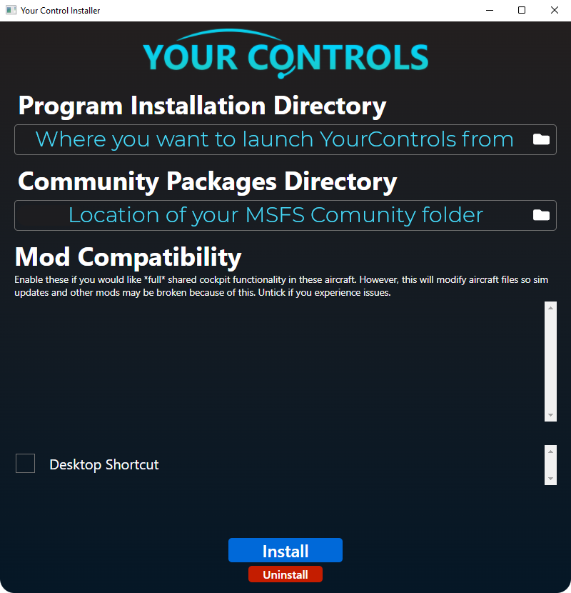
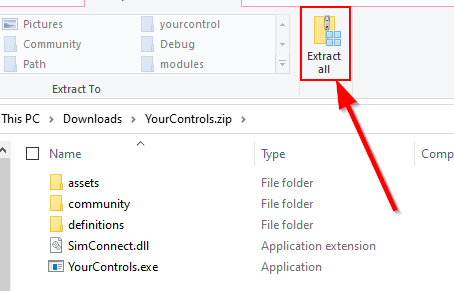
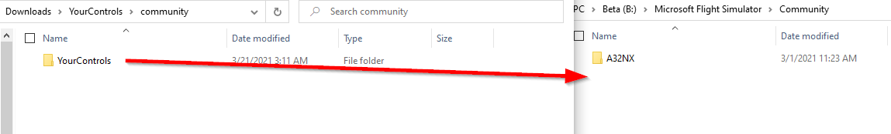

# Installing YourControls
---
### Prerequisites
Install the [Visual Studio Redistributable](https://aka.ms/vs/16/release/vc_redist.x64.exe)

### Methods
There are two methods to install YourControls:

Recommended: [Automated Installer](#automated-installer)

Alternative: [Manual Install](#manual-install)

---
## Automated Installer
The easiest way to install YourControls is to use our [installer](https://github.com/sequal32/yourcontrolsinstaller/releases/latest/download/installer.zip).

!!! warning
    If you are unable to open the installer, you may need to install [WebView2](https://go.microsoft.com/fwlink/p/?LinkId=2124703)

!!! info
    You can change the installation directory by clicking on the folder icon next to the respective directories. The installer will attempt to detect your community folder automatically, but if it doesn't, you'll have to manually select it.

!!! warning
    **Mod Compatibility:** If you tick any of the options listed here, the installer will install full shared cockpit support. Be advised that this will modify the aircraft files, so if you have any mods installed, it will most likely break the mod.

---
## Manual Install
1. Download the latest release from [here](https://github.com/sequal32/yourcontrols/releases/latest/download/YourControls.zip)
2. Extract the files anywhere you'd like
3. Drag the `YourControls` folder into the MSFS `Community` folder. This is the same folder where you would install a scenery package or an addon aircraft
4. Launch `YourControls.exe`

