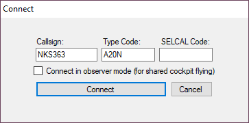
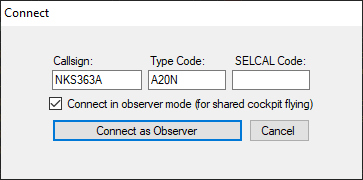
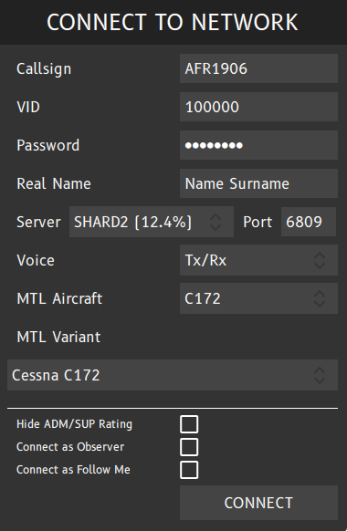
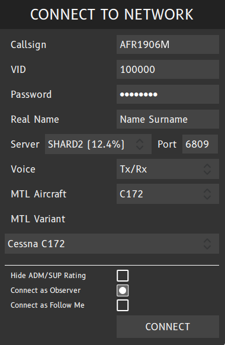

# VATSIM & IVAO
---
The best part about shared cockpit is helping each other reduce workload while flying on online networks.

- [VATSIM](https://vatsim.net/)
- [IVAO](https://ivao.aero/)

---
# Vatsim With vPilot
Please see the [official vPilot Documentation](https://vpilot.rosscarlson.dev/Documentation#shared-cockpit) for more information.

## Host
The hoster can connect to vPilot as they normally would.

## Joiners
The people joining the host should have the same callsign, **but with a letter after the callsign**. They should also tick on observer mode. There is no limit to the number of people that can join. However, **each person who joins must have a different letter after their callsign**

# IVAO Altitude
---
Please see the official [IVAO Altitude Client documentation](https://wiki.ivao.aero/en/home/devops/manuals/altitude#connecting-cockpit-sharing-connection-to-ivao) for more information.

## Host
The host can connect to IVAO Altitude as they normally would.

## Joiners
The people joining the host should have the same callsign, **but with the letter M after the callsign.** They should also connect as an observer.

!!! info
    The official IVAO documentation states that the observer should connect with a letter M, but doesn't explicitly state if more than two people can share an aircraft. I haven't tried it myself, but it should work similarly to vPilot.