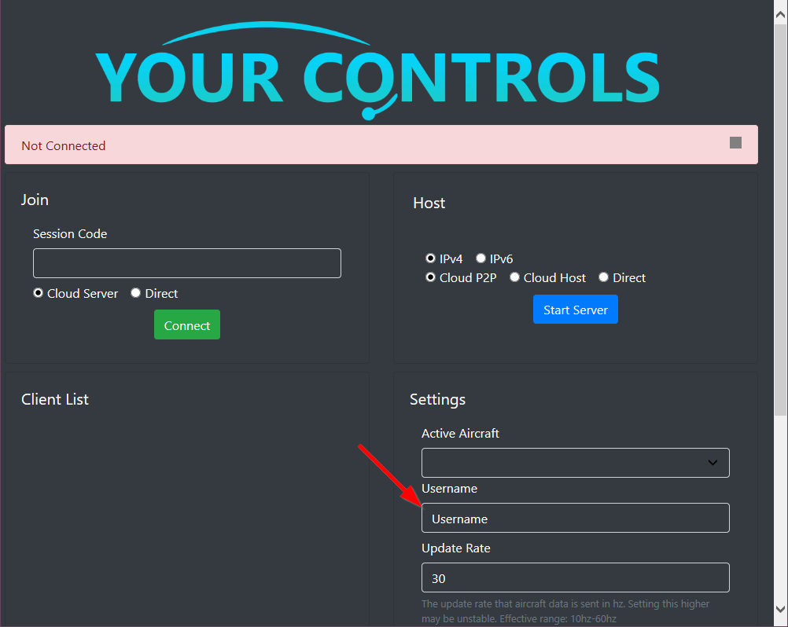

# Running YourControls
---
You've [installed YourControls](installing.md) and now you're ready to get started!

!!! warning
    Ensure everybody has the same **navdata, scenery installed** and the **same weather** set.

## Initial Setup
---
1) Launch Microsoft Flight Simulator. Select the **same aircraft** and spawn in at the **same location**.
    
!!! Failure
    Do not enable multiplayer unless you're on different servers.

2) Once everyone has spawned in, launch `YourControls.exe` and enter a username.

## Hosting A Server
---
There are multiple options to hosting a server. Please try to use Cloud P2P or Direct, and only use Cloud Host as a fallback. The description of the different methods are as follows:

### Cloud P2P (Preferred)
Cloud P2P utilizes a rendezvous server in order to connect two computers behind a router. Depending on your router, this may fail and you'll have to use other connection methods.
A session code will be provided once you hit Start Server. Give the session code to the joiners.

### Cloud Host
Cloud Host utilizes a hosted server that relays traffic between computers. Because of the high traffic this uses, the current connection limit is capped at 100.
A session code will be provided once you hit `Start Server`. Give the session code to the joiners.

### Direct
Direct establishes a direct connection between computers using IPs. This requires [port forwarding](https://www.youtube.com/watch?v=usSpl0yJFnY), or that all clients are on a local network.
Enter the port you port forwarded (UDP Port 25071 is the default), then give your [external IP](https://whatsmyip.com) to the joiners.

## Joining A Server
---
If given a **Session Code**, click `Cloud Server`, paste the code you've received, and click `Connect`. If given an **IP**, confirm with the person hosting whether it is `IPv4` or `IPv6`, enter the port they have opened, and click `Connect`

## After Connecting
---
You're now ready to fly! Only one person has control over throttles/flight controls at any given time. To transfer controls...

- Click the `Give Control` button next to the person's name in the `Connection List`
- Assign a keybinding in the MSFS controls settings to `Toggle Launch Bar Switch`. When triggered, control will be given to the first person in the `Connection List`.
  
To restrict a person from messing with the aircraft, you can click the `Observer` button next to their name.

---

## Important Notes
---
!!! warning "Turn Off Crash Physics"
    Both you and your copilot(s) are recommended to turn off crash physics as there can be some de-sync issues that stresses your aircraft too much.

!!! warning "Interacting With Avionics/FMC's"
    For the G1000/FMC/other avionics, only **one person should be interacting with a given area at a time**. For example, one person flies while the other fills out the flightplan (you should not be filing out the flightplan at the same time), or one person adjusts the transponder while another zooms out the map. This is to avoid de-synchronization issues.

!!! info "Loading From SimBrief"
    If you want to load a SimBrief Flightplan in the A32NX, you need to **set the same SimBrief username in the AOC settings**. For other aircraft that use SimBrief to import, set the same username via their methods.

!!! info "Persistent State"
    For aircraft and avionics that have setting saving functionality (A32NX, Working Title, etc.), the state of the aircraft may be different depending on those settings. You should verify that you and your copilot(s) have the same settings.